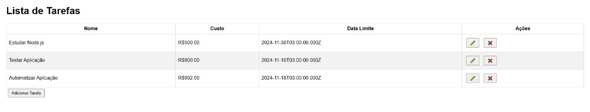

# Sistema Lista de Tarefas Este é um sistema web para cadastro de tarefas, desenvolvido para manter os dados das tarefas em um banco de dados. O sistema permite que os usuários adicionem, editem e excluam tarefas, bem como reordenem a lista de tarefas. 

## Funcionalidades 

### Lista de Tarefas 
- Exibe todos os registros mantidos na tabela "Tarefas". 
- Apresenta as tarefas ordenadas pelo campo "Ordem de apresentação". 
- Destaca as tarefas com custo maior ou igual a R$1.000,00 com um fundo amarelo. 
- Exibe botões para editar e excluir cada tarefa. 
- Inclui um botão para adicionar novas tarefas. 
### Excluir - Permite a exclusão de uma tarefa. 
- Apresenta uma mensagem de confirmação antes de excluir.
### Editar 
- Permite a edição de uma tarefa. 
- Apenas "Nome da Tarefa", "Custo" e "Data Limite" podem ser alterados. 
- Verifica se o novo nome da tarefa já existe na base de dados antes de salvar as alterações. 
- Implementação através de uma nova tela (popup) para edição dos campos. 
### Incluir 
- Permite a inclusão de uma nova tarefa. 
- Campos informados pelo usuário: "Nome da Tarefa", "Custo" e "Data Limite". 
- O registro recém-criado será o último na ordem de apresentação. 
- Verifica se o nome da tarefa já existe na base de dados antes de adicionar.

## Tecnologias Utilizadas 
- Node.js
- Express.js 
- MySQL 
- HTML 
- CSS
- JavaScript 
## Instalação e Configuração 
### Backend 
1. Certifique-se de ter o Node.js e o MySQL instalados. 
2. Navegue até o diretório `backend`: 
```bash 
cd backend
npm install
npm start
Navegue até o diretório frontend e abra o arquivo index.html em um navegador.
```


